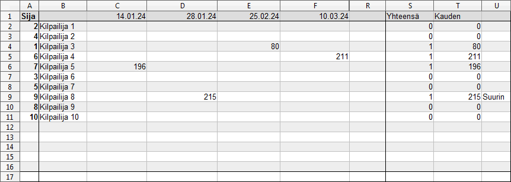

# 3 Suurin kala

Tälle välilehdelle kirjataan suurimman kalan paino osakilpailun sarakkaaseen kilpailijalle, joka kyseisen tittelin on voittanut.

Sija
`=Tulokset.B2`

Kilpailija
`=IF(Tulokset.C2 = ""; ""; Tulokset.C2)`

Kisapäivät
`=IF(Tulokset.D1 = ""; ""; Tulokset.D1)`

Yhteensä

`=IF($B2 = ""; "";IF($C2="";0;IF(RANK(C2;$C$2:$C$16;0) = 1; 1;0))+IF($D2="";0;IF(RANK(D2;$D$2:$D$16;0) = 1; 1;0))+IF($E2="";0;IF(RANK(E2;$E$2:$E$16;0) = 1; 1;0))+IF($F2="";0;IF(RANK(F2;$F$2:$F$16;0) = 1; 1;0))+IF($G2="";0;IF(RANK(G2;$G$2:$G$16;0) = 1; 1;0))+IF($H2="";0;IF(RANK(H2;$H$2:$H$16;0) = 1; 1;0))+IF($I2="";0;IF(RANK(I2;$I$2:$I$16;0) = 1; 1;0))+IF($J2="";0;IF(RANK(J2;$J$2:$J$16;0) = 1; 1;0))+IF($K2="";0;IF(RANK(K2;$K$2:$K$16;0) = 1; 1;0))+IF($L2="";0;IF(RANK(L2;$L$2:$L$16;0) = 1; 1;0))+IF($M2="";0;IF(RANK(M2;$M$2:$M$16;0) = 1; 1;0))+IF($N2="";0;IF(RANK(N2;$N$2:$N$16;0) = 1; 1;0))+IF($O2="";0;IF(RANK(O2;$O$2:$O$16;0) = 1; 1;0))+IF($P2="";0;IF(RANK(P2;$P$2:$P$16;0) = 1; 1;0))+IF($Q2="";0;IF(RANK(Q2;$Q$2:$Q$16;0) = 1; 1;0))+IF($R2="";0;IF(RANK(R2;$R$2:$R$16;0) = 1; 1;0))+0)`

Kauden suurin
`=IF($B2 = ""; "";MAX(C2:R2))`
