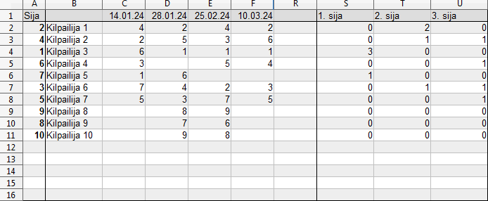

# 4 sija
Tällä välilehdellä on laskettu kilpailijan sijoitus erikseen kussakin osakilpailussa. 

- [1. Sarjataulukko](standings.md)
- [2. Tulokset](results.md)
- [3. Suurin kala](biggest_fish.md)
- [4. Sijoitus](ranking.md)

## sija
`=Tulokset.B2`

## Kilpailija
`=IF(Tulokset.C2 = ""; ""; Tulokset.C2)

## Kisapäivät
`=IF(Tulokset.D1 = ""; ""; Tulokset.D1)`

## 4.1 Sijoitukset

Kullekin osallistuneelle kilpailijalle lasketaan osakilpailu kohtainen sijoitus.

`=IF(Tulokset.D2="";"";RANK(Tulokset.D2;Tulokset.D$2:D$21;0))`

## 4.2 1. Sija

Lasketaan kilpailijan osakilpailu voitot yhteen.

`=IF($B2 = ""; ""; COUNTIF($C2:$R2;1))`

## 4.3 2. Sija

Lasketaan kilpailijan osakilpailun toiset sijat yhteen.

`=IF($B2 = ""; ""; COUNTIF($C2:$R2;2))`

## 4.4 3. Sija

Lasketaan kilpailijan osakilpailun kolmannet sijat yhteen.

`=IF($B2 = ""; ""; COUNTIF($C2:$R2;3))`
