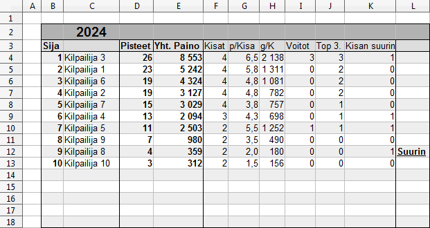

# Sarjataulukko
Tällä sivulla kilpailijat näytetään järjestyksessä. 

## Sija

Lisätään sijoitus, mikäli "Tulokset" -välilehdellä on kirjattu samalle riville mikätahansa sijoitus sarakkeessa A.

`=IF(Tulokset.A2 = "";"";X)`

> [!NOTE]
> Tämä on ongelmallinen tapa, mikäli välissä on kilpailijoita, joilla ei ole vielä tulosta.

## Kilpailija

`=VLOOKUP(B4;Tulokset.$A$2:$P$13;2;0)`

## Pisteet

`=IF(B4="";"";VLOOKUP(C4;Tulokset.$B$2:$U$13;18;0))`

## Yht. paino

`=IF(B4="";"";VLOOKUP(C4;Tulokset.$B$2:$U$13;19;0))`

## Kisat

`=IF(B4="";"";VLOOKUP(C4;Tulokset.$B$2:$U$13;20;0))`

## p/Kisa

`=IF(B4="";"";D4/F4)`

## g/Kisa

`=IF(B4="";"";E4/F4)`

## Voitot

`=IF(B4="";"";VLOOKUP(C4;Sijoitus.$B$2:$U$13;18;0))`

## Top 3.

`=IF(B4="";"";VLOOKUP(C4;Sijoitus.$B$2:$U$13;18;0) + VLOOKUP(C4;Sijoitus.$B$2:$U$13;19;0) + VLOOKUP(C4;Sijoitus.$B$2:$U$13;20;0))`

## Kisan suurin

`=IF(B4="";"";VLOOKUP(C4;'Suurin kala'.$B$2:$U$13;18;0))`

## Suurin (kausi)

`=IF(B4="";"";VLOOKUP(C4;'Suurin kala'.$B$2:$U$13;20;0))`
